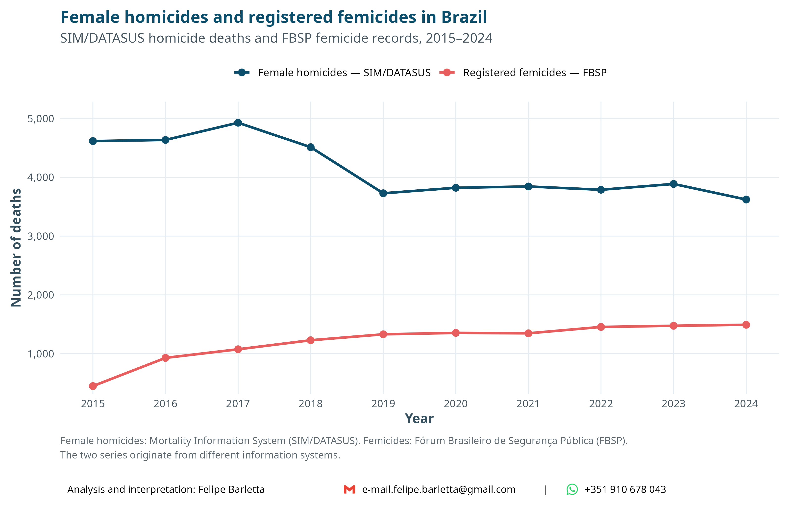
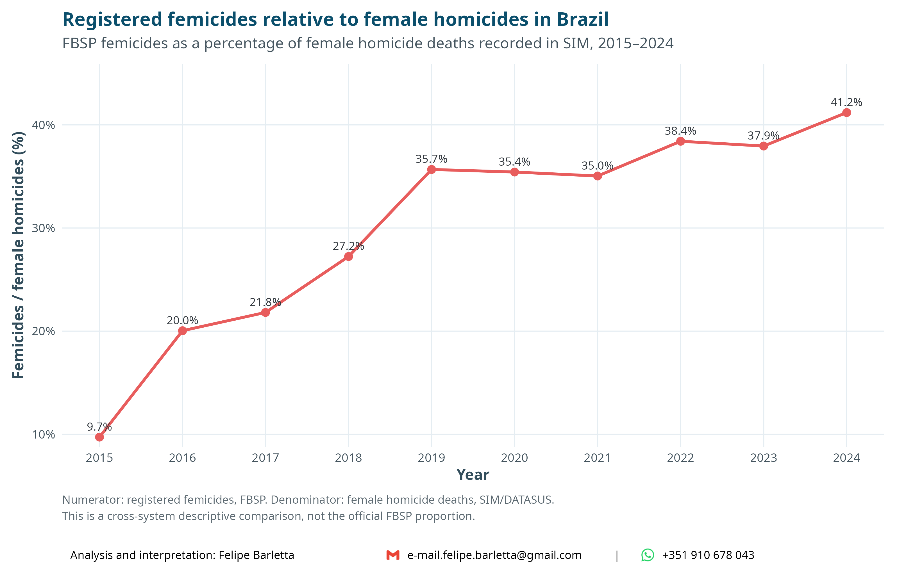

# Mortality among women in Brazil

A reproducible analysis of mortality among women in Brazil, with a focus on
homicide, suicide, and registered femicide.

The study covers **2010–2024** and combines official mortality and population
data with public-security statistics.

## Research question

How has mortality among women in Brazil changed over time, particularly with
respect to homicide, suicide, and registered femicide?

## Data sources

### Mortality Information System — SIM/DATASUS

Individual mortality records are obtained from the Brazilian Mortality
Information System (SIM), maintained by the Brazilian Ministry of Health and
distributed through DATASUS.

The analysis includes deaths of women recorded between 2010 and 2024.

For external causes, ICD-10 codes are used to identify:

- **Suicide:** X60–X84
- **Homicide:** X85–X99 and Y00–Y09
- **Undetermined intent:** Y10–Y34

### Population — IBGE

Annual female population estimates are obtained from the **IBGE Population
Projections, 2024 Revision**.

Population estimates refer to July 1 of each year and are used as denominators
for crude mortality rates.

### Femicide — FBSP

Registered femicide counts are obtained from the **Fórum Brasileiro de
Segurança Pública (FBSP)**.

The femicide series is analyzed from **2015 onward**, following the legal
recognition of femicide in Brazil.

Femicide records and SIM homicide deaths originate from different information
systems and should therefore not be interpreted as directly equivalent
measures.

## Analysis

The analysis follows a descriptive sequence:

1. Female deaths from all causes in absolute numbers.
2. Crude female mortality rates.
3. External causes of death among women.
4. Homicide and suicide deaths in absolute numbers.
5. Homicide and suicide mortality rates.
6. Registered femicides.
7. Registered femicides relative to female homicide deaths recorded in SIM.

Additional analyses describe mortality according to age and race/skin color.

Cause-specific homicide and suicide mortality rates are expressed per
**100,000 women**.

## Main figures

### Female mortality over time

### External causes of death

### Homicide and suicide

### Femicide

## Important interpretation note

A homicide of a woman recorded in SIM is **not automatically a femicide**.

SIM identifies the underlying cause of death using ICD-10 codes, whereas
femicide is a legal and contextual classification related to gender-based
violence. Consequently, femicide cannot be identified from the underlying
ICD-10 cause alone.

The comparison between FBSP femicide records and SIM female homicide deaths is
therefore presented as a **cross-system descriptive comparison**, rather than
as an estimate of the proportion of SIM homicides formally classified as
femicide.

## Reproducibility

The complete analysis is contained in:

`women_homicide_suicide_Brazil_2010_2024.Rmd`

The workflow downloads and processes the required mortality and population
data and generates the figures used in the report.

Large raw and processed mortality files are intentionally excluded from this
repository.

## Software

The analysis was conducted in **R**, using packages including:

- `microdatasus`
- `dplyr`
- `tidyr`
- `ggplot2`
- `readxl`
- `scales`
- `cowplot`
- `kableExtra`

## Author

**Felipe Barletta**

Analysis, statistical programming, and interpretation.

## Disclaimer

This is an independent analysis of publicly available data.

The interpretations and conclusions presented here are the responsibility of
the author and do not necessarily represent the views of the Brazilian
Ministry of Health, IBGE, or the Fórum Brasileiro de Segurança Pública.
