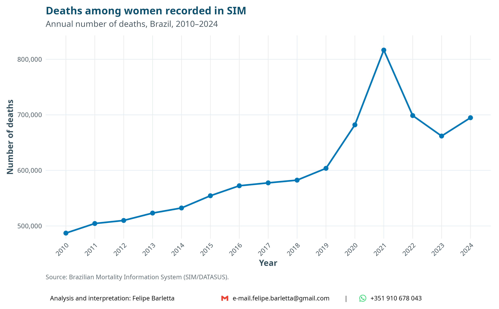
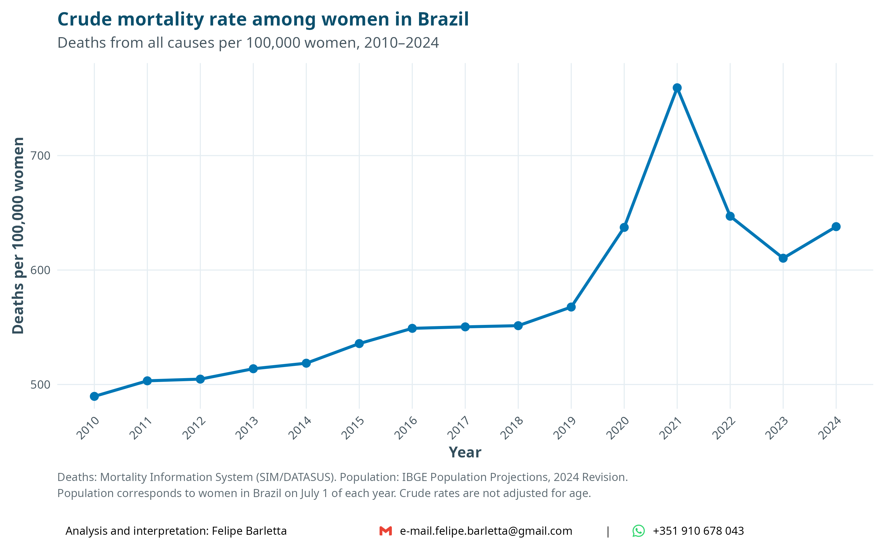
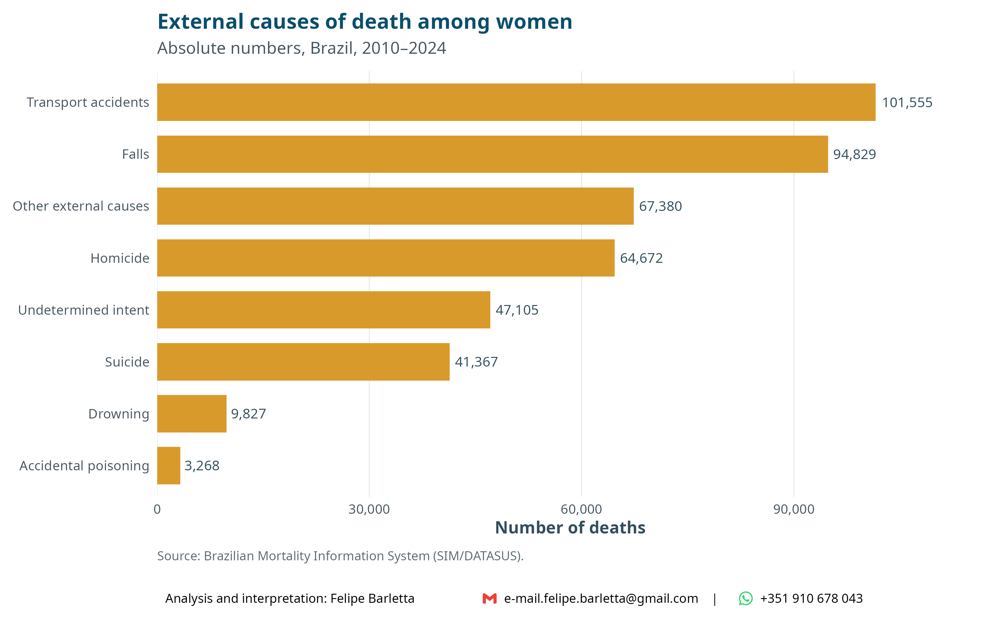
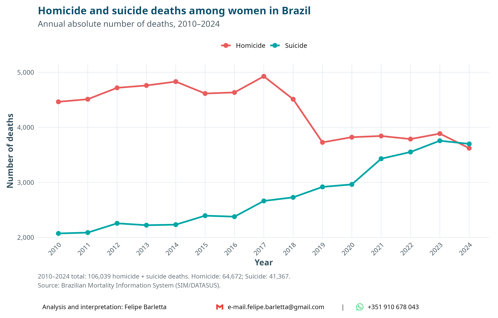
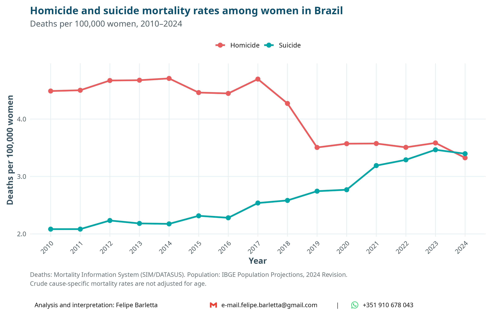
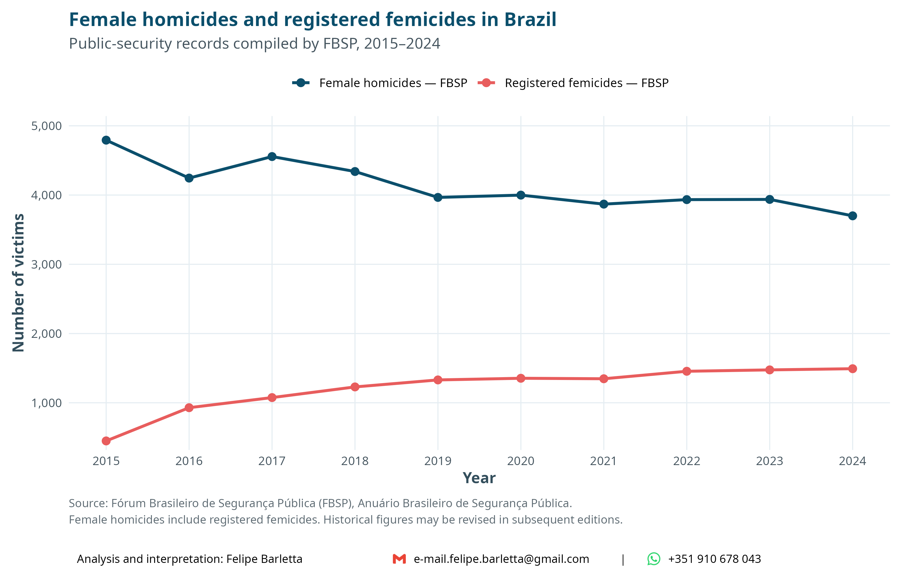
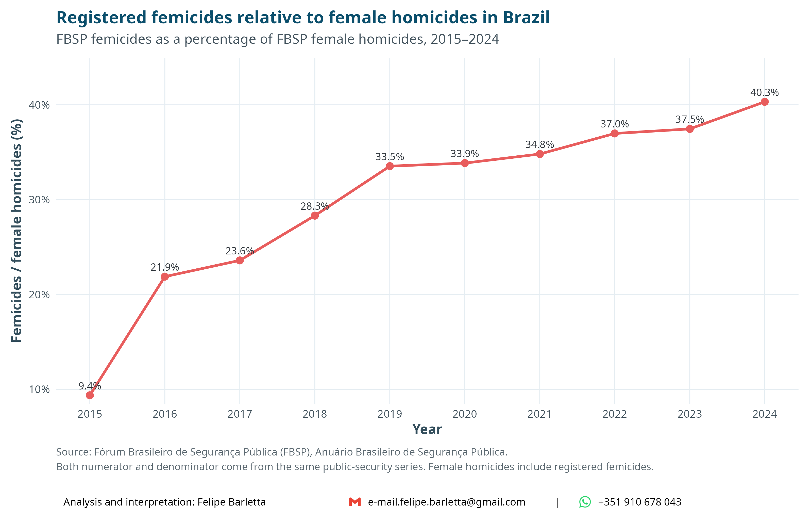
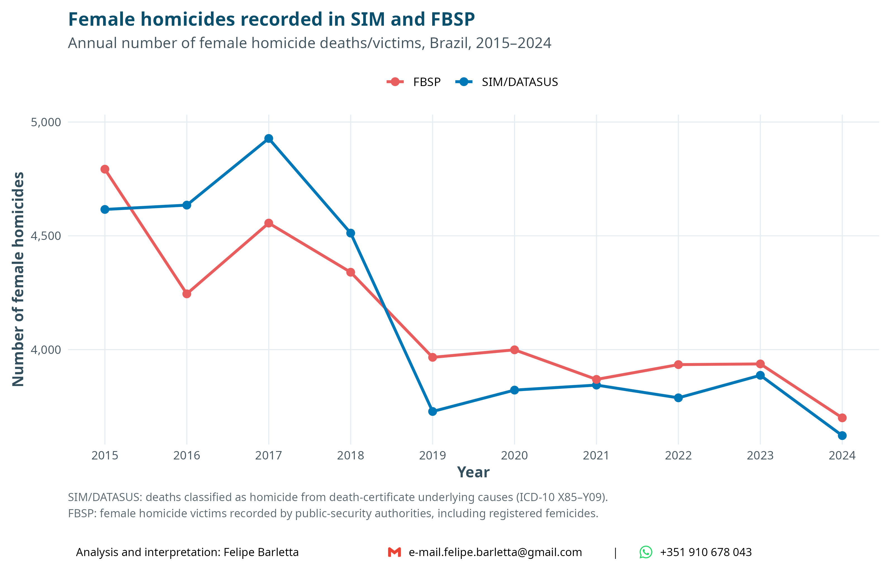

# Mortality among women in Brazil

A reproducible analysis of mortality among women in Brazil, with a focus on
homicide, suicide, and registered femicide.

The study covers **2010–2024** and combines official mortality and population
data with public-security statistics.

## Research question

How has mortality among women in Brazil changed over time, particularly with
respect to homicide, suicide, and registered femicide?

## Data sources

### Mortality Information System — SIM/DATASUS

Individual mortality records are obtained from the Brazilian Mortality
Information System (SIM), maintained by the Brazilian Ministry of Health and
distributed through DATASUS.

The analysis includes deaths of women recorded between 2010 and 2024.

For external causes, ICD-10 codes are used to identify:

- **Suicide:** X60–X84
- **Homicide:** X85–X99 and Y00–Y09
- **Undetermined intent:** Y10–Y34

### Population — IBGE

Annual female population estimates are obtained from the **IBGE Population
Projections, 2024 Revision**.

Population estimates refer to July 1 of each year and are used as denominators
for crude mortality rates.

### Female homicides and femicides — FBSP

Female homicide and registered femicide counts are obtained from the
**Fórum Brasileiro de Segurança Pública (FBSP)** and its
*Anuário Brasileiro de Segurança Pública*.

The FBSP series is analyzed from **2015 onward**, following the legal
recognition of femicide in Brazil.

For this analysis, the FBSP female-homicide series includes registered
femicides. Historical values use revised figures reported in subsequent
editions of the Brazilian Public Security Yearbook whenever available.

Because both female homicides and registered femicides are available from
FBSP, the proportion of female homicides registered as femicide is calculated
within the same public-security information system.

SIM/DATASUS female homicide deaths are retained as a separate mortality
series and compared with FBSP female homicide records in an additional
cross-system analysis.

## Analysis

The analysis follows a descriptive sequence:

1. Female deaths from all causes in absolute numbers.
2. Crude female mortality rates.
3. External causes of death among women.
4. Homicide and suicide deaths in absolute numbers.
5. Homicide and suicide mortality rates.
6. Female homicides and registered femicides recorded by FBSP.
7. Registered femicides as a percentage of female homicides recorded by FBSP.
8. Comparison of female homicide counts recorded in SIM/DATASUS and FBSP.

Additional analyses describe mortality according to age and race/skin color.

Cause-specific homicide and suicide mortality rates are expressed per
**100,000 women**.

## Main figures

### Female mortality over time

### External causes of death

### Homicide and suicide

### Female homicides and femicides — FBSP

### Female homicides — SIM/DATASUS vs FBSP

## Important interpretation note

A homicide of a woman is **not automatically a femicide**.

SIM/DATASUS identifies deaths according to the underlying cause recorded on
the death certificate using ICD-10 codes. Femicide, in contrast, is a legal
and contextual classification related to gender-based violence and cannot be
identified from the underlying ICD-10 cause alone.

For this reason, the femicide proportion in this project is calculated using
**FBSP data for both the numerator and denominator**:

**registered femicides / female homicides recorded by FBSP**

Female homicides recorded in SIM/DATASUS are analyzed separately. The
SIM/DATASUS and FBSP homicide series originate from different information
systems, with different purposes, definitions, reporting flows, and revision
procedures. Differences between the two series are therefore interpreted
descriptively and should not be treated as measurement error in either source.

## Reproducibility

The complete analysis is contained in:

`women_homicide_suicide_Brazil_2010_2024.Rmd`

The workflow downloads and processes the required mortality and population
data, incorporates the consolidated FBSP historical series, and generates the
figures used in the report.

Large raw and processed mortality files are intentionally excluded from this
repository.

## Software

The analysis was conducted in **R**, using packages including:

- `microdatasus`
- `dplyr`
- `tidyr`
- `stringr`
- `purrr`
- `forcats`
- `readr`
- `readxl`
- `ggplot2`
- `scales`
- `cowplot`

## Author

**Felipe Barletta**

Analysis, statistical programming, and interpretation.

## Disclaimer

This is an independent analysis of publicly available data.

The interpretations and conclusions presented here are the responsibility of
the author and do not necessarily represent the views of the Brazilian
Ministry of Health, IBGE, or the Fórum Brasileiro de Segurança Pública.
